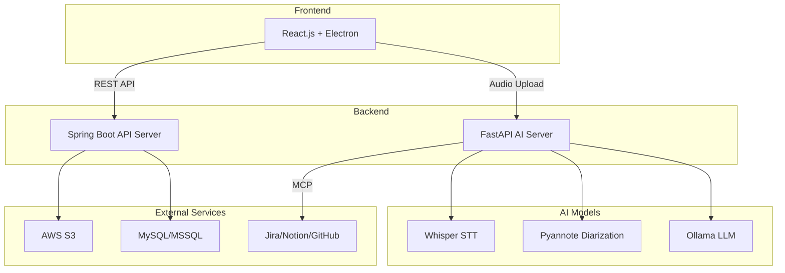

## AI Model Server (FastAPI)

### 기술 스택

| 기술 | 버전 | 용도 |
| --- | --- | --- |
| FastAPI | 0.115.0 | 웹 프레임워크 |
| Faster-Whisper | 1.0.3 | 음성 인식 (STT) |
| Pyannote.audio | 3.1.1 | 화자 분리 |
| LangChain + LangGraph | 0.3+ | LLM 오케스트레이션 |
| LangChain-Ollama | 0.2+ | 로컬 LLM 연동 |
| PyTorch | 2.4.1 | 딥러닝 백엔드 |

### 서비스 구조

```
app/
├── api/              # API 라우터
│   ├── record_router.py   # STT + 화자분리
│   ├── mcp_router.py      # MCP 연동
│   └── health_router.py   # 헬스체크
├── services/
│   ├── stt_service.py          # Whisper STT
│   ├── diarization_service.py  # 화자 분리
│   ├── summary_service.py      # 요약 생성 (Legacy)
│   ├── processor.py            # MCP 프로세서
│   └── tool_manager.py         # 동적 도구 관리
├── models/           # LLM 모델 로더
└── schemas/          # Pydantic 스키마

```

### 핵심 API: `/transcribe-diarize`

**Input:**

| 파라미터 | 타입 | 필수 | 설명 |
| --- | --- | --- | --- |
| file | File | ✅ | 오디오 파일 (mp3, wav, m4a) |
| createUserId | String | ✅ | 요청 사용자 ID |
| language | String | - | 언어 코드 (ko, en, ja) |
| min_speakers | Integer | - | 최소 화자 수 |
| max_speakers | Integer | - | 최대 화자 수 |

**Output:**

```json
{
  "resultCode": 1,
  "device": "cuda",
  "language": "ko",
  "duration": 54.2,
  "speaker_count": 2,
  "segments": [
    {"start": 0.0, "end": 2.5, "speaker": "SPEAKER_00", "text": "..."}
  ],
  "full_text": "전체 텍스트",
  "summary": "AI 생성 요약",
  "tasks": {"tasks": [...]},
  "fileId": 105
}

```

---

## 🔧 핵심 기능 상세

### 1. AI 회의록 분석 파이프라인


### 2. MCP (Model Context Protocol) 연동

외부 서비스와의 동적 연동을 지원합니다:

| 서비스 | 연동 기능 |
| --- | --- |
| **Notion** | 회의록 페이지 자동 생성 |
| **Google Calendar** | 마감일 이벤트 추가 |
| **GitHub** | 이슈 자동 생성 |
| **Jira** | 태스크 자동 생성 |

### 3. 역할 기반 대시보드

| 역할 | 대시보드 특징 |
| --- | --- |
| **팀원** | 오늘의 할 일, 주간 캘린더, 개인 업무 현황 |
| **팀장** | 프로젝트 현황, 팀원 업무 부하, 진행률 차트 |
